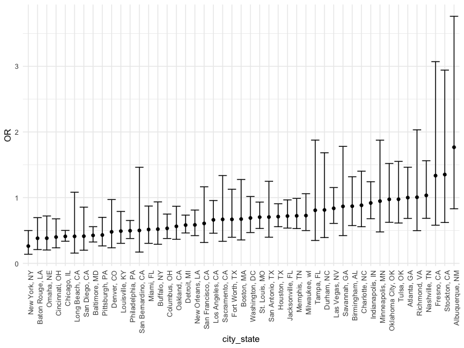
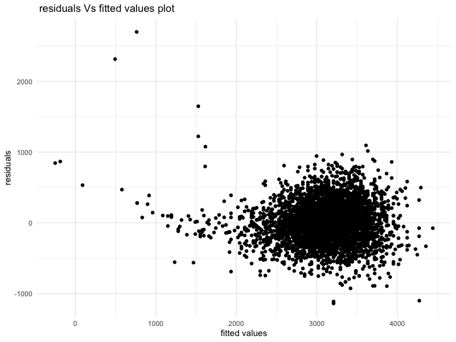
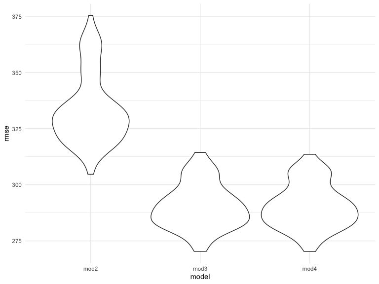

kz2383\_hw6
================

problem 2

data cleaning steps:create variable city\_state, resolution ; eliminate
cities with no race reported and wrong entry; limit race to black and
white for analysis

``` r
homicide = 
  read_csv("homicide.csv") %>% 
  mutate(
    city_state = str_c(city, state, sep = ", "),
    victim_age = as.numeric(victim_age),
    resolution = case_when(
      disposition == "Closed without arrest" ~ 0,
      disposition == "Open/No arrest"        ~ 0,
      disposition == "Closed by arrest"      ~ 1)
  ) %>% 
  filter(
    victim_race %in% c("White", "Black"),
    !(city_state %in% c("Tulsa, AL", "Dallas, TX", "Phoenix, AZ", "Kansas City, MO"))) %>% 
  mutate(victim_race = fct_relevel(victim_race, "White")) %>% 
  select(city_state, resolution, victim_age, victim_sex, victim_race)
```

    ## Rows: 52179 Columns: 12
    ## ── Column specification ────────────────────────────────────────────────────────
    ## Delimiter: ","
    ## chr (9): uid, victim_last, victim_first, victim_race, victim_age, victim_sex...
    ## dbl (3): reported_date, lat, lon
    ## 
    ## ℹ Use `spec()` to retrieve the full column specification for this data.
    ## ℹ Specify the column types or set `show_col_types = FALSE` to quiet this message.
    
    
After data cleaning, there are  39693 cases recorded over the past decades. There are 5 variables included in the data. Possible NAs are dropped for better analysis. 


Compute 95% confidence interval for odds ratio of solving homocides
comparing male and female in baltimore and the each city in the complete
dataset

``` r
baltimore_glm = 
  filter(homicide, city_state == "Baltimore, MD") %>% 
  glm(resolution ~ victim_age + victim_sex + victim_race, family = binomial(), data = .)

baltimore_glm %>% 
  broom::tidy() %>% 
  mutate(
    OR = exp(estimate), 
    OR_CI_upper = exp(estimate + 1.96 * std.error),
    OR_CI_lower = exp(estimate - 1.96 * std.error)) %>% 
  filter(term == "victim_sexMale") %>% 
  select(OR, OR_CI_lower, OR_CI_upper)
```

    ## # A tibble: 1 × 3
    ##      OR OR_CI_lower OR_CI_upper
    ##   <dbl>       <dbl>       <dbl>
    ## 1 0.426       0.325       0.558

``` r
results = 
  homicide %>% 
  nest(data = -city_state) %>% 
  mutate(
    models = map(data, ~glm(resolution ~ victim_age + victim_sex + victim_race, family = binomial(), data = .x)),
    tidy_models = map(models, broom::tidy)) %>% 
  select(-models, -data) %>% 
  unnest(tidy_models) %>% 
  mutate(
    OR = exp(estimate), 
    OR_CI_upper = exp(estimate + 1.96 * std.error),
    OR_CI_lower = exp(estimate - 1.96 * std.error)) %>% 
  filter(term == "victim_sexMale") %>% 
  select(city_state, OR, OR_CI_lower, OR_CI_upper)

results %>% 
  mutate(city_state = fct_reorder(city_state, OR)) %>% 
  ggplot(aes(x = city_state, y = OR)) + 
  geom_point() + 
  geom_errorbar(aes(ymin = OR_CI_lower, ymax = OR_CI_upper)) + 
  theme(axis.text.x = element_text(angle = 90, hjust = 1))
```



The confidence interval for odds ratio of homicide case in baltimore is
(0.325,0.558) with an estimated odds ratio of 0.426.

Among the rest cities in the complete dataset. New York NY has the
lowest odds ratio for comparing homicides solved between male and female
victims with the upper confidence interval lower than 1 ,suggesting
small difference between number of homicides solved for males and
females. Albuquerque,NM has the highest odds ratio for comparing
homicides solved comparing male victims and female victims with upper
confidence interval almost reaching 3.8, suggesting huge difference
between number of homicides solved for males and females.

problem 3

data cleaning step：babysex, father race and mother race are recoded and
malform is converted to logical value.

``` r
bwt = read_csv("birthweight.csv") %>% 
  janitor::clean_names() %>%
  mutate(
    babysex = as.factor(babysex),
    babysex = fct_recode(babysex, "male" = "1", "female" = "2"),
    frace = as.factor(frace),
    frace = fct_recode(frace, "white" = "1", "black" = "2", "asian" = "3", 
                       "puerto rican" = "4", "other" = "8"),
    malform = as.logical(malform),
    mrace = as.factor(mrace),
    mrace = fct_recode(mrace, "white" = "1", "black" = "2", "asian" = "3", 
                       "puerto rican" = "4"))
```

    ## Rows: 4342 Columns: 20
    ## ── Column specification ────────────────────────────────────────────────────────
    ## Delimiter: ","
    ## dbl (20): babysex, bhead, blength, bwt, delwt, fincome, frace, gaweeks, malf...
    ## 
    ## ℹ Use `spec()` to retrieve the full column specification for this data.
    ## ℹ Specify the column types or set `show_col_types = FALSE` to quiet this message.

``` r
bwt
```

    ## # A tibble: 4,342 × 20
    ##    babysex bhead blength   bwt delwt fincome frace gaweeks malform menarche
    ##    <fct>   <dbl>   <dbl> <dbl> <dbl>   <dbl> <fct>   <dbl> <lgl>      <dbl>
    ##  1 female     34      51  3629   177      35 white    39.9 FALSE         13
    ##  2 male       34      48  3062   156      65 black    25.9 FALSE         14
    ##  3 female     36      50  3345   148      85 white    39.9 FALSE         12
    ##  4 male       34      52  3062   157      55 white    40   FALSE         14
    ##  5 female     34      52  3374   156       5 white    41.6 FALSE         13
    ##  6 male       33      52  3374   129      55 white    40.7 FALSE         12
    ##  7 female     33      46  2523   126      96 black    40.3 FALSE         14
    ##  8 female     33      49  2778   140       5 white    37.4 FALSE         12
    ##  9 male       36      52  3515   146      85 white    40.3 FALSE         11
    ## 10 male       33      50  3459   169      75 black    40.7 FALSE         12
    ## # … with 4,332 more rows, and 10 more variables: mheight <dbl>, momage <dbl>,
    ## #   mrace <fct>, parity <dbl>, pnumlbw <dbl>, pnumsga <dbl>, ppbmi <dbl>,
    ## #   ppwt <dbl>, smoken <dbl>, wtgain <dbl>

Variable `babysex`,`blength`,`bhead`and `parity` are included in the
linear model. Based on interpretation of the model, there is a negative
intercept of -6125.3. All four variables have a positive estimated value
and are significant with p-value much lower than 0.05. The plot
displaying residuals Vs fitted values suggests a rather good fit for the
model except for some data points distribute randomly away from the
center. Specifically, the observed residual seems to be rather large for
fitted value of 500 ,750 and around 1500.

``` r
model1 = lm(bwt ~ babysex + blength + bhead + parity , data = bwt)

model1 %>% 
  broom::tidy()
```

    ## # A tibble: 5 × 5
    ##   term          estimate std.error statistic   p.value
    ##   <chr>            <dbl>     <dbl>     <dbl>     <dbl>
    ## 1 (Intercept)    -6125.      97.6     -62.7  0        
    ## 2 babysexfemale     40.8      8.89      4.59 4.59e-  6
    ## 3 blength           85.1      2.07     41.1  5.95e-312
    ## 4 bhead            148.       3.51     42.2  0        
    ## 5 parity            73.7     42.6       1.73 8.37e-  2

``` r
bwt %>%
  add_residuals(model1) %>%
  add_predictions(model1) %>%
  ggplot(aes(x = pred, y = resid)) + 
  geom_point() + 
  labs(
    x = "fitted values",
    y = "residuals",
    title = " residuals Vs fitted values plot"
  )
```



``` r
library(purrr)

cv_df = 
  crossv_mc(bwt, 100) %>% 
  mutate(
    model2 = map(train, ~lm(bwt ~ blength + gaweeks, data = .x)),
    model3 = map(train, ~lm(bwt ~ babysex + blength + bhead + parity, data = .x)),
    model4 =  map(train, ~lm(bwt ~ bhead + blength + babysex + bhead * blength + bhead * babysex+ babysex * blength+ bhead * blength * babysex, data = .x))) %>% 
  mutate(
    rmse_mod2 = map2_dbl(model2, test, rmse),
    rmse_mod3 = map2_dbl(model3, test, rmse),
    rmse_mod4 = map2_dbl(model4, test, rmse)) 

cv_df %>% 
  dplyr::select(starts_with("rmse")) %>% 
  pivot_longer(
    everything(),
    names_to = "model", 
    values_to = "rmse",
    names_prefix = "rmse_") %>% 
  ggplot(aes(x = model, y = rmse)) + geom_violin()
```


Comparing root mean square error for each constructed model, model 3
includes `babysex`,`blength`,`bhead`and `parity` has the lowest value,
suggesting the best fitness. The first model only includes`blenght`and
`gaweeks` has the largest rmse as expected due to limited number of
estimators taken into account. The last model includes
`bhead`,`blength`, `babysex` and all possible variable interactions has
slightly higher rmse than the second model. This could potentially be
explained by existing interactions between variables. In general. model3
turned out to be the optimal one after comparing rmse values, suggesting
the best fit among the three.
